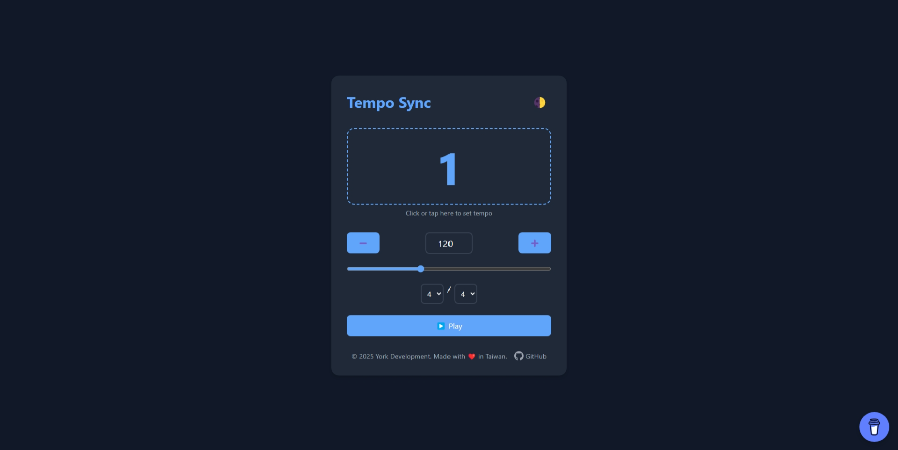
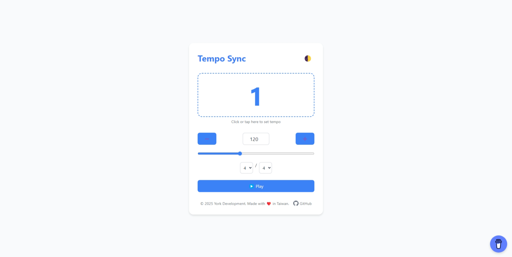

<p align="center">
  <a href="#License" target="_blank">
    
  </a>
    
  </a>
  <a>
    
  </a>
  <a>
    
  </a>
</p>

<p align="center">
  <table>
    <tr>
      <td></td>
      <td></td>
    </tr>
  </table>
</p>

**Tempo Sync** is a simple yet powerful online metronome app designed to help musicians keep time while playing. Whether you're practicing at home or in a band setting, Tempo Sync offers customizable tempo settings, time signatures, and an easy-to-use interface.

## Features

- Customizable Tempo: Adjust the tempo (BPM) from 20 to 300 with the input field, slider, or the up/down buttons.
- Tap Tempo: Tap the beat to automatically set the tempo based on your rhythm.
- Multiple Time Signatures: Choose from a variety of time signatures including 2/4, 3/4, 4/4, 6/8, and 8/8.
- Flash Beat Indicator: The first beat of every measure is highlighted with a flash for better visibility.
- Responsive Design: Works beautifully on both desktop and mobile devices.
- Theme Toggle: Switch between light and dark modes for a comfortable user experience.
- Audio Feedback: Hear the beat with different pitches to distinguish the downbeat from other beats.
- And more!

## How To Use

Once you open the app, you know what to do :D

## Installation

To run this project locally on your machine:

1. Clone the repository:

```bash
git clone

cd Tempo-Sync
```

2. Open the `index.html` file in your browser.

3. Enjoy the app!

## Technologies

- **HTML5:** The structure of the app is built with HTML5.
- **CSS3:** The styling of the app is created with CSS3.
- **JavaScript:** The functionality of the app is implemented with JavaScript.
- **Web Audio API:** The audio feedback is generated using the Web Audio API.

## Bug report / Feedback

If you encounter any problems during use or have feedback, please create issues to report.

## Contribution

Feel free to contribute to this project by creating issues, submitting pull requests, or improving documentation.

## License

This project is licensed under the MIT License. See the LICENSE file for more details.

## Support

When I began developing apps, my mission was simple: to create genuinely helpful tools and offer them for free. In a world saturated with paid features and ads, I aimed to build something that anyone could use without cost, simply to make life a little easier. My apps have always been ad-free, and some, like this project, are open-source. If my work can help even a small group of people become more efficient or solve a problem, it’s worth it.

### How You Can Help

If you believe in this project and would like to support its growth, here are a few ways you can contribute:

- **Donate:** Any amount, large or small, will encourge me a lot. You can sponsor the project via [Buy Me a Coffee](https://buymeacoffee.com/york0524) using the button below!
- **Spread the Word:** Share this project with your network—friends, family, or anyone who might benefit from or support it!
- **Collaborate:** If you’re a developer, designer, or have ideas for improvement, feel free to contribute to the project by creating issues, submitting pull requests, or improving documentation!

Your support, in any form, will help unlock the full potential of this app and keep it free for everyone. Thank you for helping keep this vision alive!

<p><a href="https://www.buymeacoffee.com/york0524"> </a></p><br>

Or, you can simply give the project a :star:!

_Thank you for taking the time to read and for any support you can offer. Together, we can improve this app and help more people!_

## Star History

[](https://star-history.com/#york9675/Tempo-Sync&Date)

***

© 2025 York Development

Made with :heart: in Taiwan.